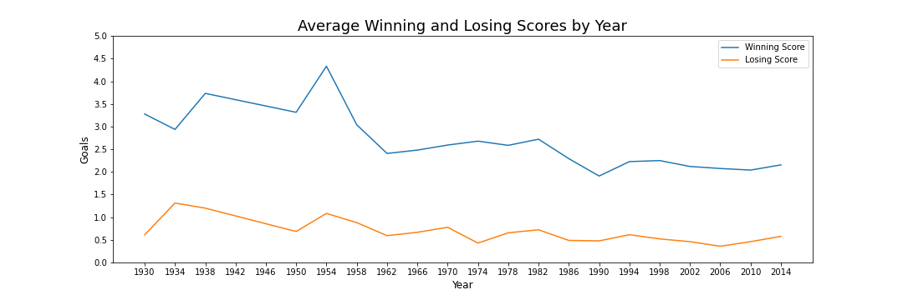

# World_Cup_Analysis

## Overview of the Analysis:

### Resources Used:
Source: https://www.kaggle.com/datasets/evangower/fifa-world-cup
Source: https://www.kaggle.com/code/shivan118/fifa-world-cup-data-analysis/notebook#Most-Number-of-World-Cup-Winning-Title
Source: https://www.kaggle.com/datasets/abecklas/fifa-world-cup?resource=download

Python. . .
Jupyter Notebook . . .
Matplotlib . . .
PostgreSQL . . .

## Questions to Answer:
1. Have goals generally increased or decreased from cup-to-cup? Do they generally increase or decrease at different stages of the tournament?
2. Which country had the best performance while acting as host for that year's World Cup?
3. Which host city has seen the most exciting matches? Which host city has been the most disappointed with boring matches?
4. Are there any trends in attendance? (Cup-to-Cup, City-to-City, Stage-to-Stage)
5. What is the best performance each country has ever had while participating in the World Cup?
6. On average, which teams make it to the furthest stage in each World Cup?
7. Which teams have appeared in the most World Cups?
8. Which teams have advanced past the group stage the most?
9. Which matchups are the most common/have the most history for each team?
10. Which matchups have each team struggled with the most/could be considered their biggest rivalrys?
11. Which team has scored the most total goals in all of their World Cup appearances?
12. Which team averages the most goals for/against in their matches?
13. Which teams have pulled off the most comeback wins after being down at 45 minutes?

## Results:

### 1. Have goals generally increased or decreased from cup-to-cup? Do they generally increase or decrease at different stages of the tournament?

1a. To answer the first question, it appears goals have trended downwards each year, with a peak in 1950 as can be seen ](Analysis/Year-to-Year/Average_Scores_by_Year.png).

### 2. 

### 3. 

### 4. 

### 5.

### 6.

### 7.

### 8.

### 9.

### 10.

### 11.

### 12.

### 13.

# Potential Errors
Russia/Soviet, EastGer/WestGer/Germany, etc.
No 1942/1946 WCs